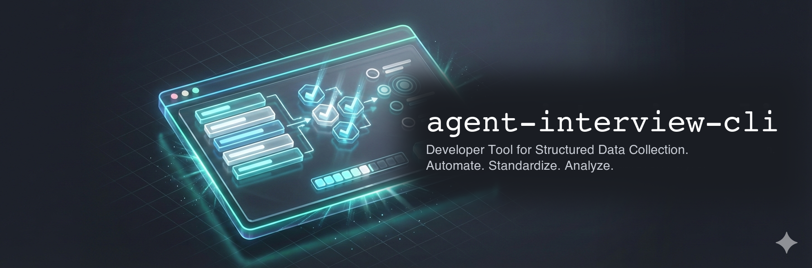
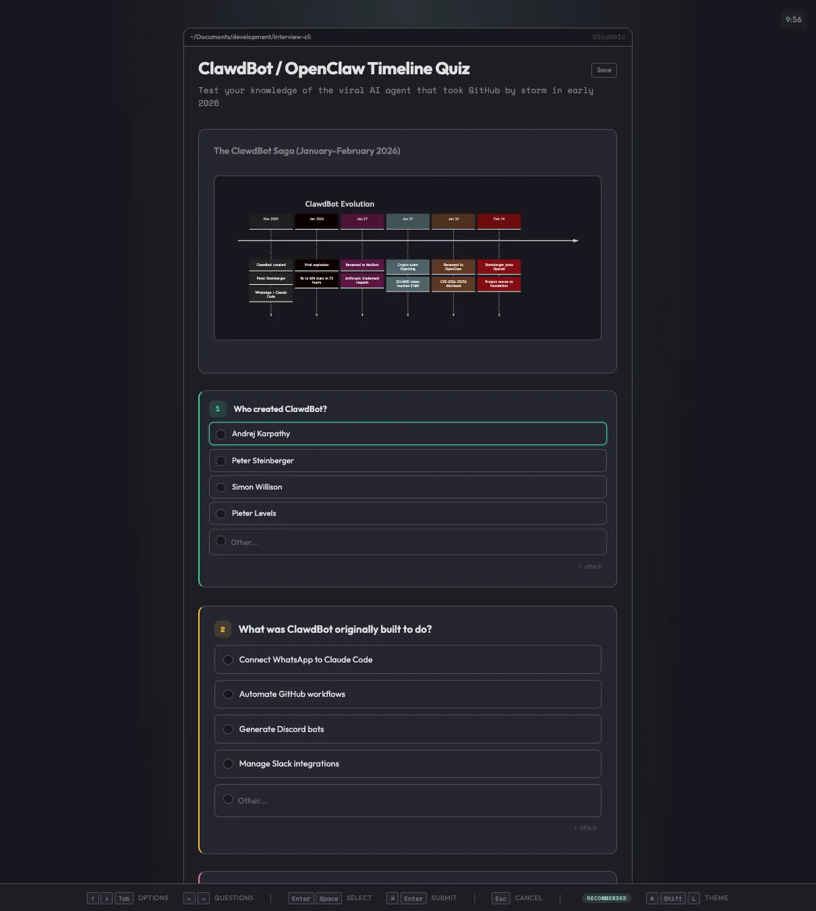

<p>
  
</p>

# agent-interview-cli

**Web forms you can pipe.** Point it at a questions file, it opens a browser form, and when the user submits you get JSON on stdout.

<p>
  
</p>

```bash
interview questions.json > responses.json
```

```json
{
  "status": "completed",
  "responses": [
    { "id": "lang", "value": "TypeScript" },
    { "id": "features", "value": ["Auth", "API"] },
    { "id": "desc", "value": "A REST service for user management" }
  ]
}
```

Status goes to stderr, data goes to stdout. Works with shell scripts, build tools, CI, AI agents — anything that can spawn a process. Zero runtime dependencies.

## Install

```bash
npm install -g agent-interview-cli

# or just run it
npx agent-interview-cli questions.json
```

## Quick Start

```json
{
  "title": "Project Setup",
  "questions": [
    { "id": "lang", "type": "single", "question": "Language?", "options": ["TypeScript", "Python", "Go"] },
    { "id": "features", "type": "multi", "question": "Features?", "options": ["Auth", "Database", "API"] },
    { "id": "desc", "type": "text", "question": "Describe the project" }
  ]
}
```

```bash
interview setup.json                # opens browser, waits, prints JSON
interview setup.json 2>/dev/null | jq '.responses'   # pipe it
interview setup.json --no-open      # print URL instead of opening browser
echo '{"questions":[...]}' | interview --stdin        # pipe questions in too
```

Submitted forms are saved as self-contained HTML snapshots. Re-open them to review or pick up where you left off:

```bash
interview ~/snapshots/project-setup-2026-02-16/index.html
```

## CLI

```
Usage: interview [options] <questions>

  <questions>              JSON file, saved interview HTML, or --stdin

  -t, --timeout <sec>      Timeout in seconds (default: 600)
  --theme <name>           Theme: default, tufte
  --mode <mode>            auto, light, dark (default: dark)
  --port <port>            Fixed port
  --no-open                Don't open browser, print URL to stderr
  --no-save                Don't save snapshot on submit
  --browser <cmd>          Browser command (e.g., "firefox")
  --snapshot-dir <dir>     Where to save snapshots
  --stdin                  Read questions from stdin
  --pretty                 Pretty-print output JSON
  -q, --quiet              Suppress stderr status messages
  -v, --verbose            Debug logging
```

Exit 0 on submit, 1 on cancel/timeout/abort, 2 on error.

Config file at `~/.config/interview/config.json` and env vars (`INTERVIEW_TIMEOUT`, `INTERVIEW_THEME`, `INTERVIEW_MODE`, `INTERVIEW_PORT`, `INTERVIEW_CONFIG`) fill in defaults. CLI flags win over env vars, env vars win over config file.

## Library

```typescript
import { interview } from 'agent-interview-cli';

const result = await interview({
  questions: {
    title: 'Project Setup',
    questions: [
      { id: 'lang', type: 'single', question: 'Language?', options: ['TypeScript', 'Python', 'Go'] },
      { id: 'desc', type: 'text', question: 'Describe the project' },
    ],
  },
  open: false,
  signal: AbortSignal.timeout(300_000),
  onReady: (url) => console.log(`Open: ${url}`),
});

if (result.status === 'completed') {
  console.log(result.responses);
}
```

The `interview()` function takes an options object and returns `{ status, responses, url }`. Pass `questions` inline or `questionsPath` to load from a file. Control the browser with `open`/`browser`, save behavior with `autoSave`/`snapshotDir`, and cancel with an `AbortSignal`. Two callbacks: `onReady(url)` fires when the server starts, `onQueued(info)` fires when another interview is already running.

Everything is exported from the top-level import — types for `Question`, `QuestionsFile`, `MediaBlock`, `CodeBlock`, `ResponseItem`, and the lower-level `startInterviewServer` if you need direct control.

## Questions

Five types: `single` (radio), `multi` (checkbox), `text` (freeform), `image` (upload), and `info` (non-interactive display panel).

```json
{
  "title": "Architecture Review",
  "description": "Review the proposed changes before implementation",
  "questions": [
    {
      "id": "approach",
      "type": "single",
      "question": "Which approach should we take?",
      "options": [
        { "label": "Rewrite", "code": { "code": "const app = new App()", "lang": "ts" } },
        { "label": "Refactor", "code": { "code": "app.migrate()", "lang": "ts" } }
      ],
      "recommended": "Refactor",
      "conviction": "strong",
      "weight": "critical",
      "context": "The current codebase has 80% test coverage"
    },
    {
      "id": "features",
      "type": "multi",
      "question": "Select features to include",
      "options": ["Auth", "Database", "API", "WebSockets"],
      "recommended": ["Auth", "API"]
    },
    {
      "id": "diagram",
      "type": "info",
      "question": "Current Architecture",
      "media": { "type": "mermaid", "mermaid": "graph LR\n  Client-->API\n  API-->DB" }
    },
    {
      "id": "notes",
      "type": "text",
      "question": "Additional requirements"
    }
  ]
}
```

Options can be plain strings or objects with `{ label, code }` for inline code snippets. Set `recommended` on single/multi questions to pre-select and badge an option — `conviction: "strong"` for high confidence, `"slight"` for low confidence (shows badge but doesn't pre-select). Use `weight: "critical"` to make a question visually prominent, `"minor"` to compact it.

The `info` type is for showing context alongside decisions — tables, mermaid diagrams, images, HTML. Media blocks go in the `media` field:

```json
{ "type": "table", "table": { "headers": ["Method", "Speed"], "rows": [["A", "Fast"], ["B", "Slow"]] } }
{ "type": "mermaid", "mermaid": "graph LR\n  A-->B" }
{ "type": "image", "src": "diagram.png", "alt": "Architecture" }
{ "type": "chart", "chart": { "type": "bar", "data": {} } }
{ "type": "html", "html": "<em>Custom content</em>" }
```

All media blocks accept `caption`, `position` (`"above"`, `"below"`, `"side"` for two-column), and `maxHeight`.

## Agent Integration

The repo ships with an `AGENTS.md` and a skill at `skills/agent-interview-cli/` for agents that support on-demand skills (like [pi](https://github.com/badlogic/pi-mono/)). Copy it to your skills directory:

```bash
cp -r skills/agent-interview-cli ~/.pi/agent/skills/
```

## How It Works

Starts an HTTP server on localhost serving a self-contained form UI (no external dependencies in the HTML). The browser talks to the server via fetch — submit, cancel, heartbeat, image upload, snapshot save. On submit, responses go to stdout and the server shuts down.

A watchdog detects if the browser tab closes (no heartbeat for 60s) and saves a recovery file. Active sessions are tracked in a shared registry so concurrent interviews don't fight over the browser — the second one fires an `onQueued` callback instead of auto-opening.

Saved snapshots are complete HTML files with the questions and answers embedded as JSON. They open in any browser without a server, and the CLI can reload them to resume or review.

## Limitations

- Node.js >= 20 required
- `--no-open` and `--no-save` need Node >= 22.4 (`parseArgs` `allowNegative`)
- Binds to `127.0.0.1` only
- If the browser never connects, the timeout only fires from the client side — the server waits until you signal it

## License

MIT
